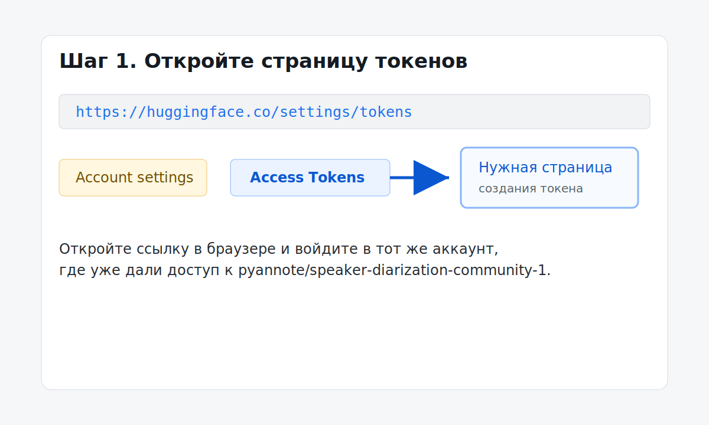
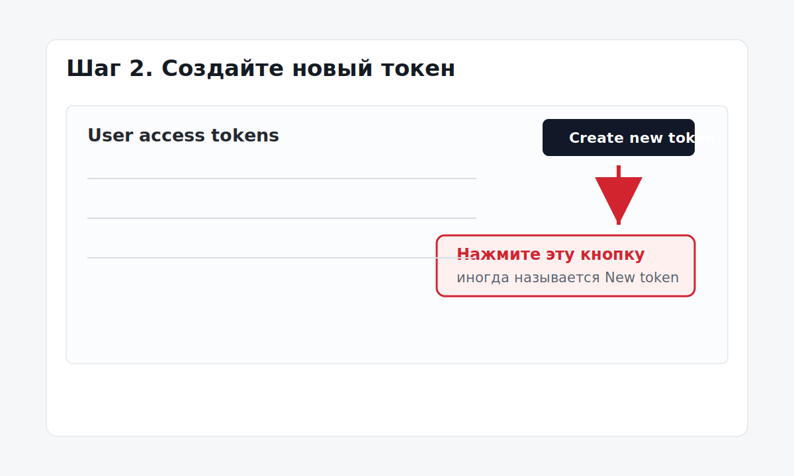
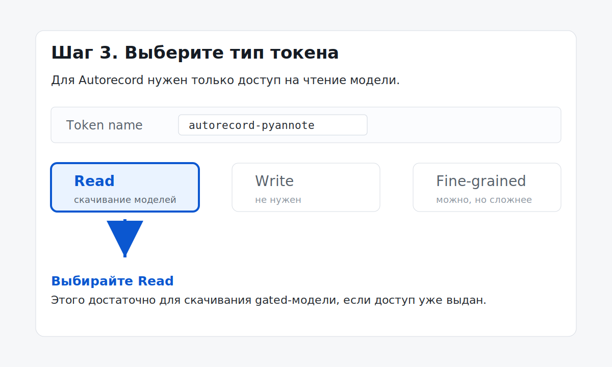
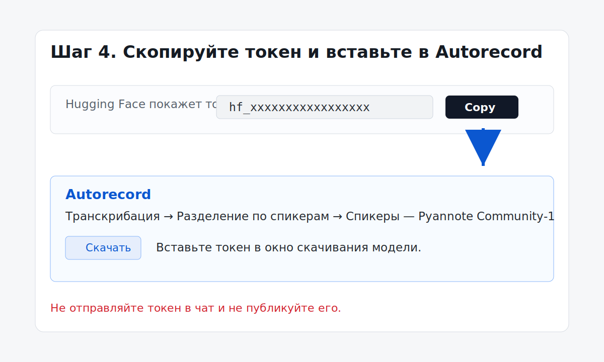

# Как получить Hugging Face token для Pyannote Community-1

Эта инструкция нужна для скачивания модели диаризации `Pyannote Community-1` в Autorecord.

Важно:

- согласие на странице модели вы уже дали, на вашем скриншоте видно `You have been granted access to this model`;
- токен нужен только для скачивания модели через GUI;
- после скачивания модель работает локально и offline;
- токен никому не отправляйте и не вставляйте в чат.

Официальная страница токенов Hugging Face: <https://huggingface.co/settings/tokens>

## Шаг 1. Откройте страницу токенов

Перейдите по ссылке:

<https://huggingface.co/settings/tokens>

Вы должны быть залогинены в тот же Hugging Face аккаунт, где вы уже дали согласие на модель `pyannote/speaker-diarization-community-1`.

## Шаг 2. Создайте новый токен

На странице токенов нажмите кнопку:

`Create new token`

или, если интерфейс у вас немного другой:

`New token`

## Шаг 3. Выберите тип токена

Самый простой вариант для Autorecord:

- `Token name`: `autorecord-pyannote`
- `Token type`: `Read`

Не выбирайте `Write` - для скачивания модели это не нужно.

Если Hugging Face показывает режим `Fine-grained`, можно использовать его, но тогда нужно явно дать чтение репозитория `pyannote/speaker-diarization-community-1`. Для обычной установки проще выбрать `Read`.

## Шаг 4. Скопируйте токен

После создания Hugging Face покажет строку, которая начинается с:

`hf_...`

Скопируйте ее сразу. Обычно полный токен показывается только один раз.

## Шаг 5. Вставьте токен в Autorecord

1. Запустите приложение через ярлык:
   `C:\Projects\autorecord\Autorecord.lnk`
2. Откройте вкладку `Транскрибация`.
3. В поле `Разделение по спикерам` выберите `Спикеры — Pyannote Community-1`.
4. Нажмите `Скачать`.
5. В появившемся окне вставьте токен `hf_...`.
6. Подтвердите скачивание.

После успешной установки статус модели должен стать `Installed`.

## Если не скачивается

Проверьте по порядку:

1. Вы залогинены на Hugging Face в тот же аккаунт, где дали согласие на модель.
2. На странице модели видно `You have been granted access to this model`.
3. Токен начинается с `hf_`.
4. Для токена выбрана роль `Read`.
5. Токен скопирован полностью, без пробелов в начале или конце.

Если ошибка похожа на `401` или `403`, чаще всего причина в том, что токен создан не в том аккаунте или у аккаунта нет доступа к gated-модели.
